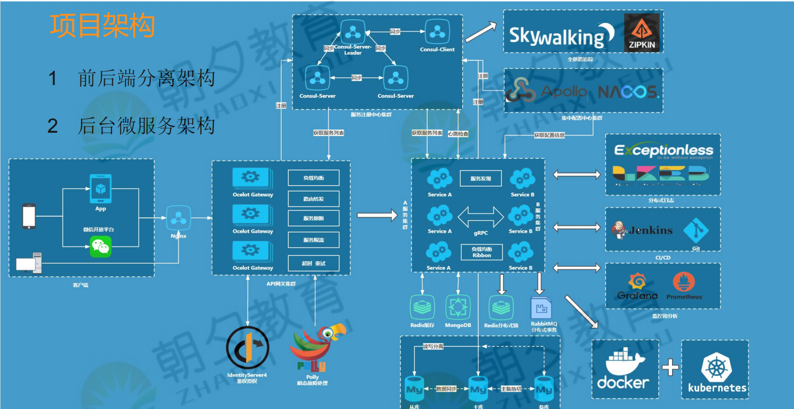
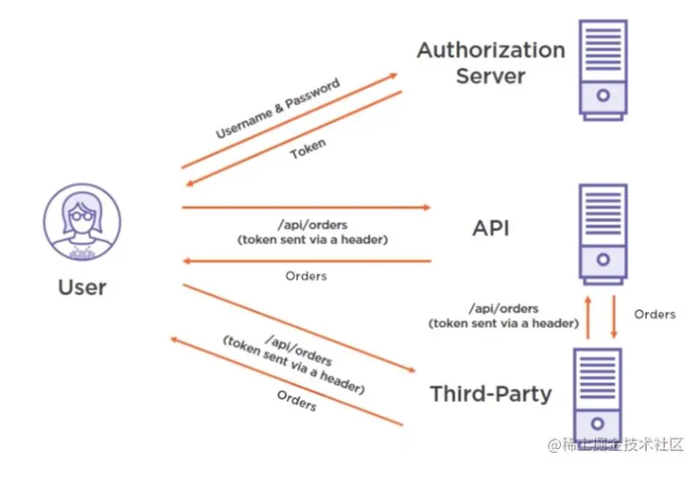
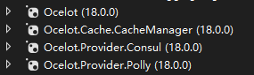
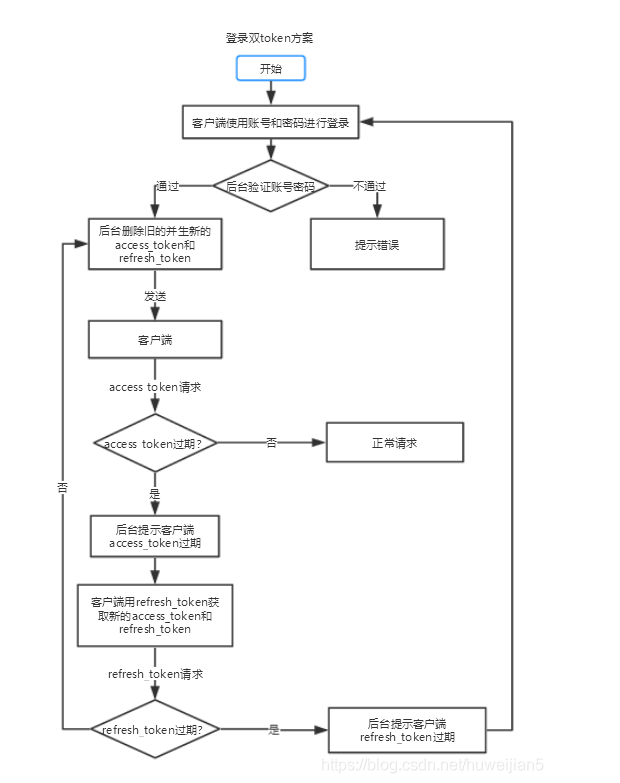
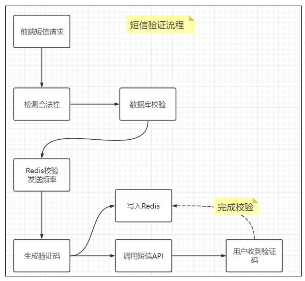

环境初始化信息

### 1. 项目架构



### 2. 技术栈

- 微服务架构组件—Consul Ocelot Apollo ... docker Kubernetes Jenkins
-  Vue+JWT+CoreWebAPI+gRPC+MinimalAPI
- MySQL-Redis-MongoDB-RabbitMQ-Kafka-ELK-分布式锁-分布式事务

### 3. 项目功能

- 注册—登陆------短信，前后分离，JWT，RefreshToken，Vue
-  首页-----------静态页
-  搜索---列表----ES
- 详情页---------页面静态化
- 购物车---------Redis-库存
- 订单----------业务就很复杂
- 支付----------微信支付
- 秒杀
  - 活动配置
  - 详情页------计时问题
  - 购物车------能不能放入购物车-库存
  -  订单-------特殊订单，要求快速支付，不需要填地址
  - 支付---------快速取消，取消后恢复秒杀

### 4. 数据库初始化

- 启动Mysql

  ```shell
  docker run -d -p 3306:3306 --name msamysql -e MYSQL_ROOT_PASSWORD=123456 -v /test/mysql/conf:/etc/mysql -v /test/mysql/mysql/:/var/lib/mysql -v /test/mysql/mysql-file:/var/lib/mysql-files mysql
  ```

- 数据准备

  执行《2.sql》文件夹中的脚本

### 5. 静态站点部署

​	静态程序：`YY.MSACormmerce.PortalProject`

- nginx.conf配置文件

  ```yml
  
  #user  nobody;
  worker_processes  1;
  #error_log  logs/error.log;
  #error_log  logs/error.log  notice;
  #error_log  logs/error.log  info;
  #pid        logs/nginx.pid;
  
  events {
      worker_connections  1024;
  }
  
  http {
      include       mime.types;
      default_type  application/octet-stream;
      sendfile      on;
     
      keepalive_timeout  65;
      client_max_body_size 100m;
  
      gzip  on;
  	
      server
    	{
    		listen 80;
    		server_name yt.image.com;
    		location /{
    			alias /myapp/;
    		}
    	}
  }
  ```

- nginx启动

  ```shell
  #创建myapp目录，将YY.MSACormmerce.PortalProject前端代码复制到该目录下
  mkdir /test/myaap
  #创建nginx挂载目录,添加nginx.conf配置文件
  mkdir /test/nignx
  vim nginx.conf
  #启动nginx
  docker run -itd -p 8000:80 -v /test/nginx/nginx.conf:/etc/nginx/nginx.conf -v /test/myapp/:/myapp/ --name msanginx nginx:latest
  ```

### 6. 关于跨服务请求

- 下单减库存-------服务间直接调用(实时性要求高)-- (设计方式) 
- 支付回调，更新订单状态---异步化架构，支持重试-- (设计方式) 
- 实时库存共享----PageDetail其实不需要详细库存---购物车+Redis局域网共享(组件) 
- 商品搜索，需要商品、品牌、规格----降维打击ElasticSearch(组件) 
- 商品详情页信息多查询压力大----静态化架构(架构方式)

### UserMicroservice实现

- 配置日志：使用log4net组件输出日志
- 配置鉴权授权

- 全局异常处理
- 配置文件
- Swagger查看

- UserController基本逻辑


### 鉴权授权中心

- 服务说明

  - 用户向统一的鉴权授权系统发起用户名和密码的校验

  - 校验通过后会颁发一个Token,用户就拿着颁发的Token去访问其他三方系统

  - 三方系统可以直接请求鉴权授权系统验证当前Token的合法性，也可以根据对称加密使用秘钥解密Token以验证合法性

    

- 新增MinimalAPI，做独立鉴权中心
- 封装JWT的API生成，Options标准封装
- 调用用户服务进行登录信息验证——HttpHelperService后续升级
- 调用本地服务，对称加密生成Token

### 网关（Ocelot）

网关作用：路由、负载均衡、整合注册发现、缓存、超时、限流、熔断、聚合

- 独立网关---WebAPI+Ocelot

- Nuget-Ocelot及配套

  

- 配置中间件和IOC

- 增加配置文件+指定地址

- 可以路由映射+转发了

- 网关配置Swagger

  网关能呈现代理服务的Swagger----理解下Swagger工作机制，其实是一个UI+Json数据---所以就可以用代理服务的json+本UI 就可以呈现。添加网关代理服务Swagger：配置文件+SwagerUI指定路径

### 服务注册与发现（Consul）

- 下载启动Consul（consule agent -dev）

- 配置文件+IOC映射+启动注册

  - Consul接入UserMicroservice
  - Consul接入AuthenticationCenter

- Consul+网关

  - 网关接入Consul---配置文件+AddConsul()
  - 完成微服务核心架构---前端+Ocelot网关+ Consul+ API集群

- 测试

  - UserService

    ```shell
    //dotnet run --urls="http://*:5726" --ip="localhost" --port=5726
    
    dotnet run --urls="http://localhost:7200" --ip="localhost" --port=7200 ConsulClientOption:IP=localhost ConsulClientOption:Port=8500 ConsulRegisterOption:IP=localhost ConsulRegisterOption:Port=7200 ConsulRegisterOption:GroupName=UserMicroservice ConsulRegisterOption:HealthCheckUrl=http://localhost:7200/Health ConsulRegisterOption:Tag=13
    
    dotnet run --urls="http://localhost:17200" --ip="localhost" --port=17200 ConsulClientOption:IP=localhost ConsulClientOption:Port=8500 ConsulRegisterOption:IP=localhost ConsulRegisterOption:Port=17200 ConsulRegisterOption:GroupName=UserMicroservice ConsulRegisterOption:HealthCheckUrl=http://localhost:17200/Health ConsulRegisterOption:Tag=113
    
    dotnet run --urls="http://localhost:27200" --ip="localhost" --port=27200 ConsulClientOption:IP=localhost ConsulClientOption:Port=8500 ConsulRegisterOption:IP=localhost ConsulRegisterOption:Port=27200 ConsulRegisterOption:GroupName=UserMicroservice ConsulRegisterOption:HealthCheckUrl=http://localhost:27200/Health ConsulRegisterOption:Tag=213
    ```

    

  - 鉴权中心

    ```shell
    //dotnet run --urls="http://*:9000" --ip="localhost" --port=9000
    
    dotnet run --urls="http://localhost:9000" ConsulClientOption:IP=localhost ConsulClientOption:Port=8500 ConsulRegisterOption:IP=localhost ConsulRegisterOption:Port=9000 ConsulRegisterOption:GroupName=AuthenticationCenter ConsulRegisterOption:HealthCheckUrl=http://localhost:9000/Health ConsulRegisterOption:Tag=13
    
    dotnet run --urls="http://localhost:19000" ConsulClientOption:IP=localhost ConsulClientOption:Port=8500 ConsulRegisterOption:IP=localhost ConsulRegisterOption:Port=19000 ConsulRegisterOption:GroupName=AuthenticationCenter ConsulRegisterOption:HealthCheckUrl=http://localhost:19000/Health ConsulRegisterOption:Tag=113
    
    dotnet run --urls="http://localhost:29000" ConsulClientOption:IP=localhost ConsulClientOption:Port=8500 ConsulRegisterOption:IP=localhost ConsulRegisterOption:Port=29000 ConsulRegisterOption:GroupName=AuthenticationCenter ConsulRegisterOption:HealthCheckUrl=http://localhost:29000/Health ConsulRegisterOption:Tag=213
    ```

    

  - 网关

    ```shell
    dotnet run --urls="http://*:8000" --ip="localhost" --port=8000
    ```

  > 问题：
  >
  > 如果服务与Consull部署在同一台机器，且Ip使用127.0.0.1，而不是localhost，会出现Ocelot调用Consul服务报错（由于目标计算机积极拒绝，无法连接）的问题（此时会使用http:hostname:port访问？？？）
  >
  > 原因：服务和Consul 在同一台电脑上则返回hostname , 在不同电脑上则返回服务所在电脑的 ipAddress.
  
### 7. JWT

  JWT局限性

- Token泄漏问题
- 修改密码后使Token失效
- 滑动过期——用户正在使用的情况下，避免Token过期

  Token泄露问题

- Token确实是客户端可见的---与Cookie/Session一样是可见
- 使用SSL通信，防止中途窃取 
- 可以额外验证点东西，IP地址，浏览器类型

防止Token泄漏后的重放攻击

- 请求表单带个随机数，Redis存储，只能访问一次 

- 限流桶，同一个Token在单位时间内只能访问多少次

用户修改密码，强制Token过期

- 修改密码，就更新秘钥，所有的token都失效(这也要求客户端得定期更新 

证书)—而且不断变证书—不可取—只有客户端模式可以，只有一个客户端的 

证书

- 来个Redis共享(限制是都能访问到这个Redis) 
- 生成token+guid+用户id—写入Redis---改密码则根据用户id删除 
  - 证token时---拿guid去redis校验 
  - 验证旧token—发现guid找不到----过期了 
  - 验证新token---没问题---也是中心化 

- 减少有效期—降低伤害，但会影响用户体验，存在用户在使用过程中，Token过期的情况

双Token

- 用户在登陆之后返回access_token和refresh_token（这里假定它们的有效期分别是2小时和7天）

- 当access_token未过期，则请求正常

- 当access_token过期了，此时服务端会返回过期提示给客户端，客户端收到提示后，使用refresh_token去获取新的access_token和refresh_token（此时它们的有效期又变为2小时和7天，旧的自然失效）

- 当refresh_toke也过期了，使用它去获取access_token时服务端就会返回过期提示，此时就应该让用户重新登陆

- 每次刷新access_token时，都会更新refresh_token的有效期

- 具体流程如下：

  

短信验证

- 具体流程如下：

  

- 短信防刷机制

  - 时间限制：60秒后才能再次发送（前端）
  从发送验证码开始，前端（客户端）会进行一个60秒的倒数，在这一分钟之内，用户是无法提交多次发送信息的请求的。
  - 手机号限制：同一个手机号，24小时之内不能够超过5条。
  - 前后端校验：提交Token参数校验
  前端（客户端）在请求发送短信的时候，同时向服务端提交一个Token参数，服务端对这个Token参数进行校验，校验通过之后，再向请求发送短信的接口向用户手机发送短信。

密码安全问题

- 必须加密，不能明文传输

- MD5加密

- 加盐：避免碰撞，name取MD5一次，作为salt，再+密码 MD5， 

  校验时，账号查询，结果再加盐对比

表单重复提交

- 前端按钮禁用
- 后端数据检测---业务不允许一模一样 (手机号重复)---唯一索引
- 业务是允许多条一样的，但是要避免错误的提交-----MD5摘要–AntiForgeryToken---存cookie+session--提交一次移除--同页面多表单
- Filter标识---对请求信息MD5摘要保存---短时间内过期--如果命中就结束
- CustomAction2CommitFilterAttribute—防止短时间误点操作 
- 幂等性设计(多方案)---允许执行多次，但是结果不变

幂等性设计

幂等性：一次和多次请求某一个资源**对于资源本身**应该具有同样的结果（网络超时等问题除外）

- 如果不是业务需求，尽量不要使用幂等性操作。
- 幂等需要通过唯一的业务单号来保证，其核心思想是把查询和变更状态操作加锁，将并行操作改为串行操作。
- 常用防重复提交策略：
  - 乐观锁——跟新已有数据，通过版本自增解决ABA问题。
  - 防重表——根据唯一业务单号，建表，利用数据库主键不能重复来去重。
  - 分布式锁——可用来替代防重复表，整思路都可以理解为加锁。
  - token令牌——需要分为两阶段，一，申请token,存入redis,二，检查redis中是否有这个token。缺点：设计复杂，需要系统两次交互
  - 缓冲区——使用消息中间件，过滤掉重复的订单。优点是同步转异步，高吞吐。不足是不能及时地返回支付结果，需要后续监听支付结果的异步返回。

